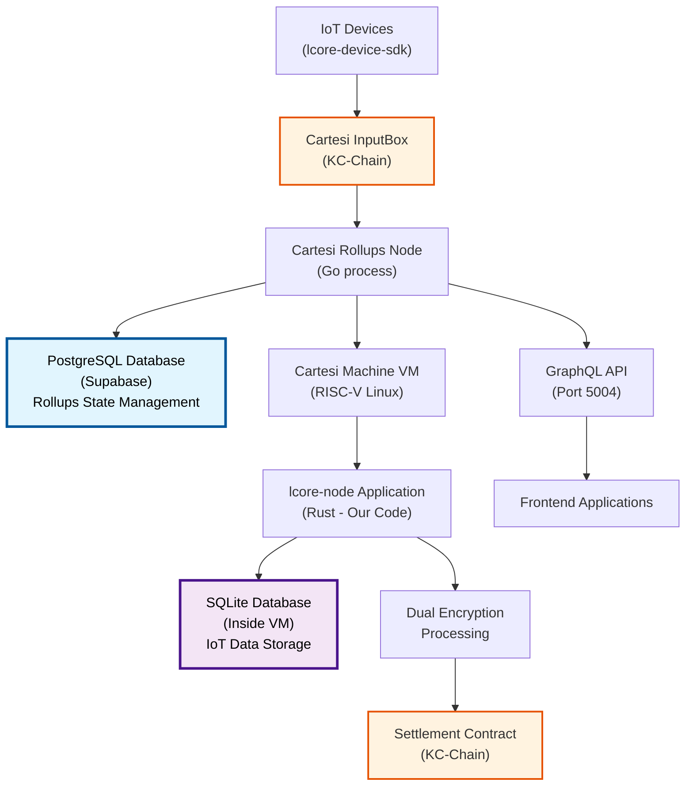

# lcore-node

`lcore-node` is the core backend service for the IoT-L{CORE} SDK ecosystem. It is a Rust-based application responsible for device communication, data processing, and integration with the Cartesi rollups node.

## 🚨 **CRITICAL: Database Architecture Understanding**

**Two Completely Separate Databases in Cartesi Integration:**

1. **PostgreSQL Database (External - Supabase)**: 
   - **Purpose**: Cartesi rollups-node state management
   - **Location**: External to Cartesi Machine (managed by Supabase)
   - **Contains**: Rollups metadata, epoch management, input processing state
   - **Used by**: Cartesi rollups infrastructure (NOT our application)

2. **SQLite Database (Internal - Our Application)**:
   - **Purpose**: IoT application logic and encrypted data storage  
   - **Location**: INSIDE the Cartesi Machine VM
   - **Contains**: Encrypted IoT data, device registrations, processing results
   - **Used by**: Our `lcore-node` Rust application

**These databases serve completely different purposes and should never be confused!**

## Features

-   **High-Performance API**: Built with Axum for a fast, modern, and reliable web service.
-   **Asynchronous Architecture**: Leverages `tokio` for efficient, non-blocking I/O.
-   **Dual-Encryption Engine**: Implements the two-stage encryption process for securing device data. (In the MVP, this is a placeholder using AES-256-GCM).
-   **Database Integration**: Uses `sqlx` for asynchronous, type-safe database access (SQLite for MVP).
-   **Cartesi Integration**: Designed to be the primary service for submitting inputs to and querying state from the Cartesi rollups node.

## 🔄 **Cartesi Integration Architecture**

When integrated with Cartesi rollups-node, the architecture includes separated database responsibilities:



**Database Responsibilities:**
- **PostgreSQL (Blue)**: External Cartesi rollups state management via Supabase
- **SQLite (Purple)**: Internal IoT application data within Cartesi VM

## Project Structure

```
lcore-node/
├── src/
│   ├── api.rs          # Axum routing and handlers
│   ├── config.rs       # Application configuration
│   ├── database.rs     # Database connection and queries
│   ├── encryption.rs   # Dual-encryption logic
│   ├── error.rs        # Custom error types
│   ├── lib.rs          # Library root, modules definition
│   └── main.rs         # Binary entry point
├── migrations/         # (Optional) SQLx database migrations
├── Cargo.toml          # Project dependencies
└── README.md
```

## Getting Started

### Prerequisites

-   Rust (latest stable version)
-   (Optional) `sqlx-cli` for managing database migrations: `cargo install sqlx-cli`

### Running the Service

1.  **Clone the repository.**
2.  **Build the project:**
    ```bash
    cargo build
    ```
3.  **Run the service:**
    ```bash
    cargo run
    ```
    The service will start on the address defined in `src/config.rs` (default: `127.0.0.1:3000`).

### Testing

Run the test suite with:

```bash
cargo test
```

## Configuration

Configuration is currently managed in `src/config.rs`. In the future, this will be expanded to support environment variables and configuration files.

## License

MIT
