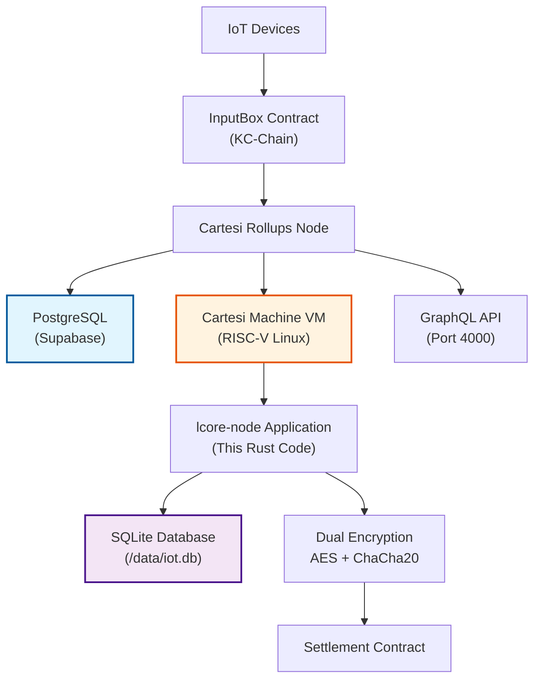

# lcore-node - Cartesi IoT Application

`lcore-node` is the core Cartesi application for the IoT-L{CORE} ecosystem. It runs inside the Cartesi Machine VM and provides complete IoT data processing with dual encryption, device authentication, and fraud-proof capabilities.

**Complete IoT Application Implementation** 

All IoT application logic has been successfully implemented within the Cartesi VM environment and is ready for production deployment.

### **Implemented Features**

- **Dual Encryption System**: AES-256-GCM + XChaCha20-Poly1305 with deterministic nonces
- **SQLite Database**: Complete schema with devices, sensor_data, device_counters, analytics
- **Device Authentication**: W3C DID + IETF JOSE signature verification
- **Cartesi Handlers**: Action-based advance/inspect handlers for IoT data pipeline
- **Deterministic Execution**: All operations designed for fraud-proof compatibility

## 🚨 **Database Architecture**

**Two Separate Databases Working Together:**

1. **PostgreSQL Database (External - Supabase)**
   - **Purpose**: Cartesi rollups-node state management
   - **Location**: External to Cartesi Machine (managed by Supabase)
   - **Contains**: Rollups metadata, epoch management, input processing state
   - **Used by**: Cartesi rollups infrastructure

2. **SQLite Database (Internal - Our Application)**
   - **Purpose**: IoT application logic and encrypted data storage  
   - **Location**: Inside the Cartesi Machine VM (`/data/iot.db`)
   - **Contains**: Encrypted IoT data, device registrations, processing results
   - **Used by**: Our `lcore-node` Rust application

## 🏗️ **Architecture**

### **Cartesi VM Integration**



### **Application Flow**

1. **Device Registration**: Devices register via InputBox with DID documents
2. **Data Submission**: Encrypted data submitted with JOSE signatures
3. **VM Processing**: lcore-node processes data inside Cartesi VM
4. **Dual Encryption**: Two-stage deterministic encryption applied
5. **Database Storage**: Encrypted data stored in SQLite within VM
6. **State Queries**: Data retrieved via inspect handlers

## 📁 **Project Structure**

```
lcore-node/
├── src/
│   ├── main.rs           # HTTP server & Cartesi handlers
│   ├── encryption.rs     # Dual encryption system (AES + ChaCha20)
│   ├── database.rs       # SQLite operations within VM
│   ├── device_auth.rs    # W3C DID + IETF JOSE authentication
│   ├── error.rs          # Error handling
│   └── lib.rs            # Library definitions
├── db/
│   └── schema.sql        # SQLite database schema
├── .cartesi/             # Cartesi VM images and config
│   ├── image.ext2        # 9.17MB VM filesystem image
│   └── config.json       # Machine configuration
├── Dockerfile            # Cartesi VM container build
├── Cargo.toml            # Rust dependencies
└── rollups-node-config.env  # Production configuration
```

## 🔧 **Building & Deployment**

### **Prerequisites**

- Docker with RISC-V support
- PowerShell (Windows) or Bash (Linux/macOS)
- Cartesi development environment

### **Build Cartesi Application**

```bash
# Build RISC-V binary for Cartesi VM
docker build --platform=linux/riscv64 -t lcore-node-dev .
```

### **Generate Cartesi Snapshot**

```powershell
# Windows
../scripts/build_snapshot_fixed.ps1

# Linux/macOS
../scripts/build_snapshot.sh
```

### **Deploy to Production**

```bash
# Deploy rollups-node with snapshot
./deploy-rollups-node.sh
```

## 🔐 **Security Implementation**

### **Dual Encryption System**

```rust
// Stage 1: AES-256-GCM with device-specific keys
let key1 = Stage1Encryption::derive_key_from_did(device_id)?;
let stage1 = Stage1Encryption::new(key1);
let nonce1 = derive_stage1_nonce(device_id, counter);
let ciphertext1 = stage1.encrypt_with_nonce(&data_bytes, &nonce1)?;

// Stage 2: XChaCha20-Poly1305 with context-specific keys
let key2 = Stage2Encryption::derive_key_from_context("iot-sensor-data-v1")?;
let stage2 = Stage2Encryption::new(key2);
let nonce2 = derive_stage2_nonce(device_id, counter);
let ciphertext2 = stage2.encrypt_with_nonce(&ciphertext1, &nonce2)?;
```

### **Device Authentication**

```rust
// W3C DID + IETF JOSE signature verification
match device_auth::verify_device_signature(&jws, &data_bytes, &public_key_json) {
    Ok(_) => println!("Device signature verified successfully!"),
    Err(e) => return Ok("reject"),
}
```

### **Deterministic Nonce Generation**

```rust
// Counter-based deterministic nonces for fraud-proof compatibility
pub fn derive_stage1_nonce(device_id: &str, counter: u64) -> [u8; 12] {
    let mut hasher = Sha256::new();
    hasher.update(device_id.as_bytes());
    hasher.update(&counter.to_be_bytes());
    let digest = hasher.finalize();
    let mut out = [0u8; 12];
    out.copy_from_slice(&digest[0..12]);
    out
}
```

## 📊 **Database Schema**

```sql
-- Device registry with DID documents
CREATE TABLE devices (
  id TEXT PRIMARY KEY,
  did_document TEXT NOT NULL,
  public_key TEXT NOT NULL,
  created_at TIMESTAMP DEFAULT CURRENT_TIMESTAMP
);

-- Per-device counters for deterministic nonces
CREATE TABLE device_counters (
  device_id TEXT PRIMARY KEY,
  counter INTEGER NOT NULL
);

-- Encrypted IoT sensor data
CREATE TABLE sensor_data (
  id INTEGER PRIMARY KEY AUTOINCREMENT,
  device_id TEXT NOT NULL,
  encrypted_payload BLOB NOT NULL,
  stage1_key_hash TEXT NOT NULL,
  stage2_key_hash TEXT NOT NULL,
  counter INTEGER NOT NULL,
  timestamp TIMESTAMP NOT NULL,
  FOREIGN KEY (device_id) REFERENCES devices(id)
);

-- Analytics and computation results
CREATE TABLE analytics (
  id INTEGER PRIMARY KEY AUTOINCREMENT,
  device_id TEXT NOT NULL,
  metric_type TEXT NOT NULL,
  value REAL NOT NULL,
  time_window TEXT NOT NULL,
  calculated_at TIMESTAMP DEFAULT CURRENT_TIMESTAMP
);
```

## 🔄 **Cartesi Handlers**

### **Advance Handler (Data Processing)**

```rust
pub async fn handle_advance(
    db: &Database,
    request: JsonValue,
) -> Result<&'static str, Box<dyn std::error::Error>> {
    let wrapped: WrappedPayload = serde_json::from_str(payload_json_str)?;
    
    match wrapped.action.as_str() {
        "register" => {
            // Device registration with DID document
            let reg: RegisterPayload = serde_json::from_value(wrapped.payload)?;
            db.insert_device(&reg.device_id, &reg.did_document, &reg.public_key)?;
            Ok("accept")
        }
        "submit" => {
            // Data submission with signature verification and encryption
            let data_pl: DataPayload = serde_json::from_value(wrapped.payload)?;
            // Verify signature, encrypt data, store in database
            Ok("accept")
        }
        _ => Ok("reject")
    }
}
```

### **Inspect Handler (Data Queries)**

```rust
pub async fn handle_inspect(
    db: &Database,
    request: JsonValue,
) -> Result<&'static str, Box<dyn std::error::Error>> {
    if let Some(device_id) = query_str.strip_prefix("get_latest:") {
        if let Some(sensor_row) = db.get_latest_sensor_data(device_id)? {
            // Decrypt data and return result
            let decrypted_data = decrypt_sensor_data(&sensor_row)?;
            // Return decrypted data
        }
    }
    Ok("accept")
}
```

## 🧪 **Testing**

### **Unit Tests**

```bash
# Run all tests
cargo test

# Run specific test module
cargo test database_test
cargo test encryption
```

### **Integration Testing**

```bash
# Test with input feeder
curl -X POST http://localhost:8080/device/register \
     -H 'Content-Type: application/json' \
     -d '{"device_id":"test_001","did_document":"...","public_key":"..."}'
```

## 🔍 **Latest Snapshot Details**

- **Template Hash**: `0x6961841b8923b3d2e85e381d5de13a200f462729a6847df13442b974b52024e0`
- **Image Size**: 9.17MB
- **RAM Configuration**: 128Mi
- **Build System**: Windows-compatible PowerShell + Linux Bash scripts

## 📚 **Dependencies**

```toml
[dependencies]
tokio = { version = "1.32", features = ["macros", "rt-multi-thread"] }
hyper = { version = "0.14", features = ["server"] }
serde = { version = "1.0", features = ["derive"] }
serde_json = "1.0"
json = "0.12"
tracing = "0.1"
tracing-subscriber = "0.3"
anyhow = "1.0"
rusqlite = "0.32"
aes-gcm = "0.10"
chacha20poly1305 = "0.10"
sha2 = "0.10"
hex = "0.4"
chrono = { version = "0.4", features = ["serde"] }
byteorder = "1.5"
```

## 📄 **License**

MIT License - see [LICENSE](../LICENSE) file for details.

---

**Status**: Phase 3 Complete - Production Ready 🚀
